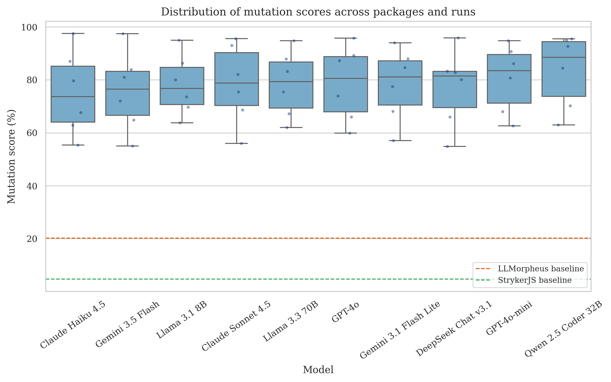
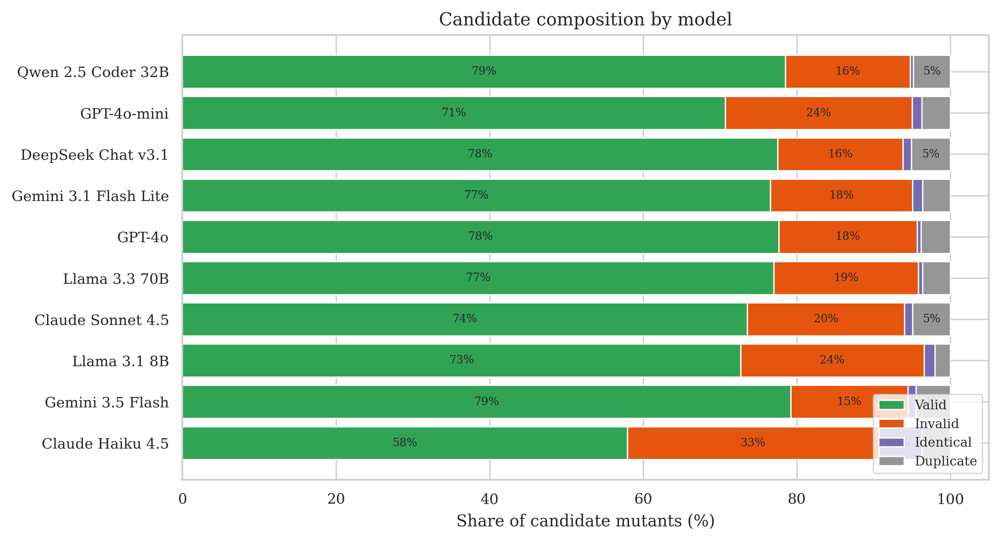
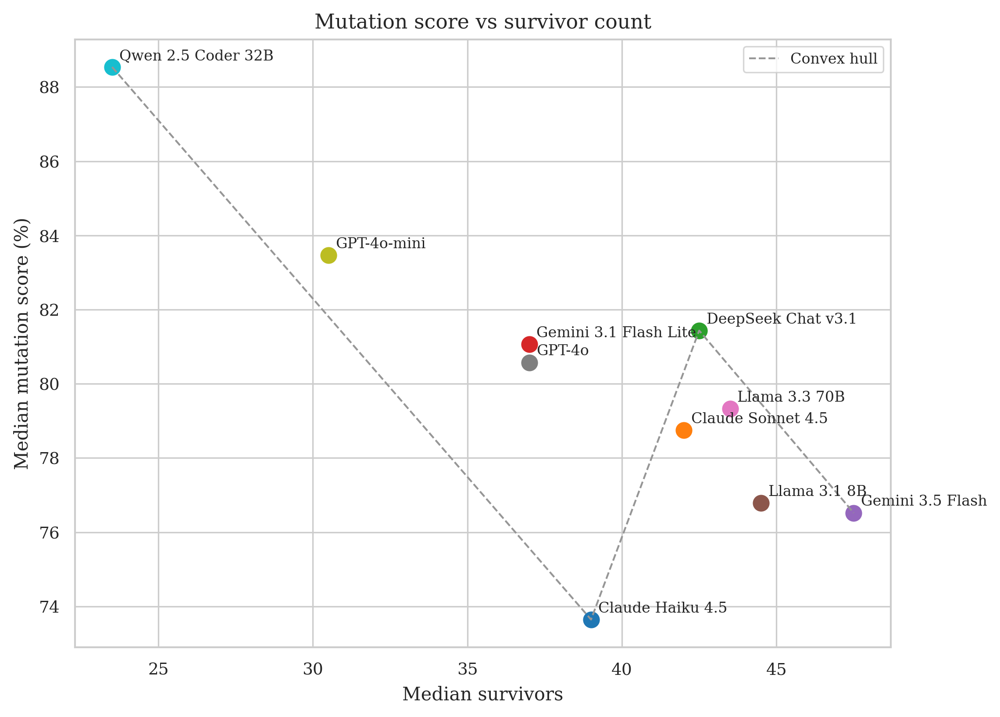
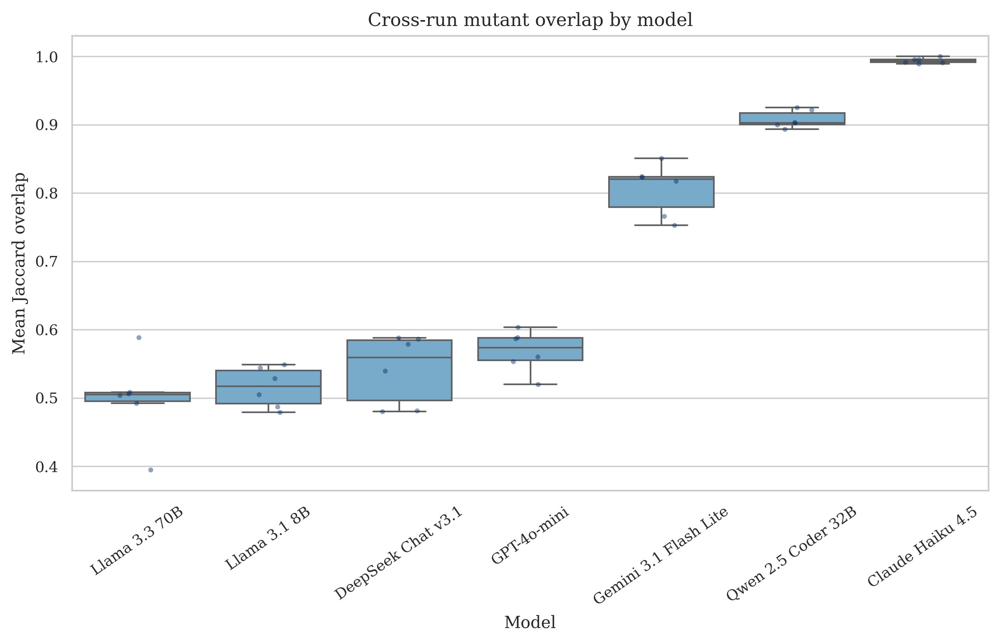
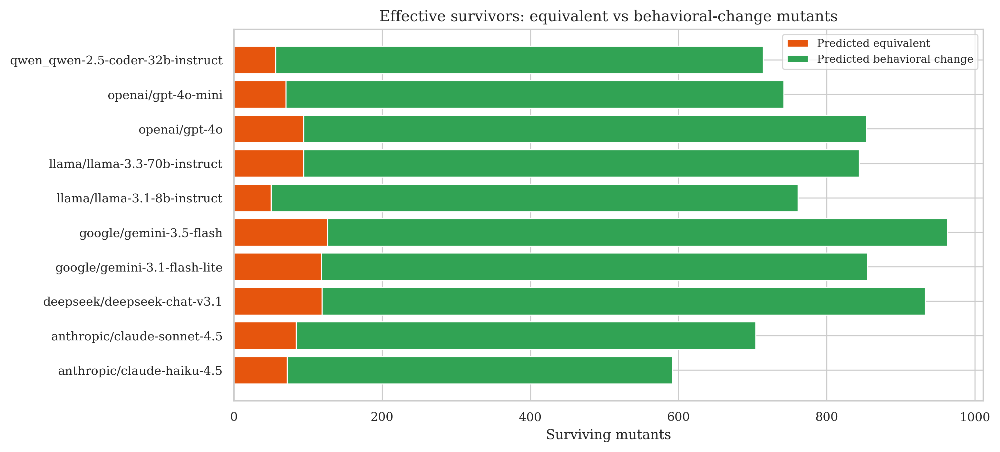
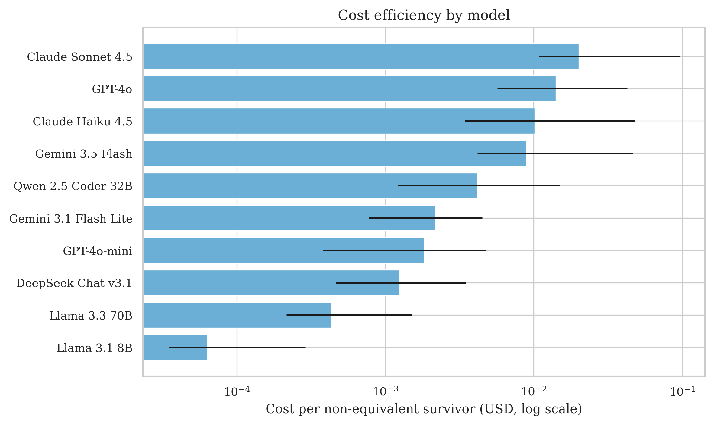
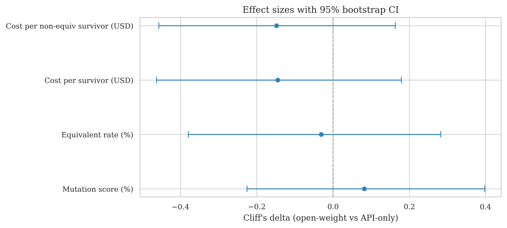
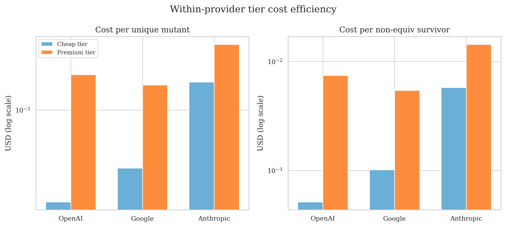

# Bachelor Thesis Exposé — Joost Windmoller

# Comparative Evaluation of Large Language Models for LLMorpheus Mutation Testing

## Effectiveness, Stability, Equivalence, and Cost

**Document purpose:** Completed empirical study (June 2026 data lock). This exposé summarizes locked findings, experimental setup, and thesis structure for examiner alignment — a condensed preview of the full thesis, not a study proposal.

---

## Meta-Info

|                                 |               |
| ------------------------------- | ------------- |
| **Supervisor / First Examiner** | \<name here\> |
| **Second Examiner**             | \<name here\> |

---

## Introduction

Mutation testing evaluates test-suite quality by injecting small faults ("mutants") and checking whether tests detect them. Traditional tools rely on fixed mutation operators, which limits the fault patterns they can simulate. **LLMorpheus** (Tip et al., 2025) replaces hand-crafted operators with LLM-generated mutants: placeholders are inserted at code locations and an LLM proposes buggy replacements, which are filtered and executed via StrykerJS.

The original LLMorpheus study evaluated models available in 2024. Since then, the LLM landscape has changed rapidly — new model families, shifting cost profiles, and growing interest in open-weight deployment. Practitioners choosing a model for mutation testing today lack updated evidence on effectiveness, run-to-run stability, equivalent-mutant rates, and cost (Sánchez et al., 2024).

**Application domain:** JavaScript projects tested with existing unit test suites (no LLM-generated tests). **Benchmark:** six-package thesis-six subset (Complex.js, countries-and-timezones, node-jsonfile, pull-stream, spacl-core, zip-a-folder).

**Problem:** The 2024 LLMorpheus evaluation does not answer how *modern* LLMs compare under a controlled, practitioner-oriented setup.

**Research gaps addressed (RQ1–RQ5):**

1. **Modern model comparison (RQ1):** Which contemporary LLMs produce the most useful mutants under fixed LLMorpheus configuration?
2. **Run-to-run stability (RQ2):** How reproducible are mutant sets at T = 0 across repeated runs?
3. **Equivalence-aware survivors (RQ3):** How much of survival is plausibly explained by equivalent mutants rather than test weakness?
4. **Cost-effectiveness (RQ4):** What does LLMorpheus cost per model, and which models offer the best quality–cost trade-offs?
5. **Deployment category (RQ5):** Do open-weight vs API-only categories differ on mutation-testing quality when all models are served via OpenRouter — and if not, does the lower API cost and self-host option of open-weight models constitute a practical advantage?

**Scope exclusions:** No LLM-based test generation; reasoning vs non-reasoning pairs not compared (reasoning disabled); 40-bug resemblance study not re-run; **no external replication** of Tip et al. (2025) aggregates.

**Baseline caveat:** Six packages vs the paper's thirteen (`delta`, `q`, and others excluded); CodeLlama-34B unavailable on OpenRouter (404); overlapping models `gpt-4o-mini` and `llama-3.3-70b-instruct` are **longitudinal peers**, not replication targets.

**Thesis propositions:**

**Main proposition (RQ1–RQ4):**

> Language models are not interchangeable as drivers of the LLMorpheus pipeline; they differ in effectiveness, run-to-run stability, predicted equivalence among survivors, and cost under a fixed configuration.

**Secondary proposition (RQ5):**

> Open-weight and API-only deployment categories do not differ on mutation-testing quality. With no quality penalty at the category level, open-weight models are cheaper on commercial API access and can be self-hosted to avoid per-token cloud charges — a genuine practitioner advantage. *(API token costs measured via OpenRouter; self-host infrastructure cost not benchmarked.)*

---

## Approach and Findings

### Experimental setup

| Component | Detail |
|-----------|--------|
| **Models** | 10 LLMs via OpenRouter — 3 open-weight (Llama 3.1 8B, Llama 3.3 70B, Qwen 2.5 Coder 32B), 6 API-only, 1 hybrid (DeepSeek Chat v3.1) |
| **Run policy** | **Multi (5 reps):** 7 affordable models — RQ2 uses all reps; RQ1/RQ3/RQ4/RQ5 use run1 for cross-model comparison. **Single (1 rep):** GPT-4o, Gemini 3.5 Flash, Claude Sonnet 4.5 (€15–40 per full run) |
| **Packages** | thesis-six (6 JS packages, pinned commits); excludes low-scoring paper packages notably `q` (11.94% in Tip et al.) |
| **Config** | `template-full`, T = 0, maxTokens = 250, reasoning disabled; Gemini 3.x minimal effort |
| **Pipeline** | GitHub Actions → LLMorpheus → Stryker (`--usePrecomputed`) → `thesis/` analysis scripts |
| **RQ3 classifier** | UniXCoder ensemble, θ = 0.80 on surviving mutants; gold labels from Tip et al. manual corpus (954 mutants); macro-F1 ≈ 0.80 on gold — all applied labels are **predicted**, not ground-truth proofs |
| **RQ4 pricing** | Pinned OpenRouter snapshot (May 2026); **cost per non-equivalent survivor** requires RQ3 counts |
| **RQ0 scope** | Internal pipeline validation only; results are time- and provider-conditional (Angermeir et al., 2026; Siddiq et al., 2025) |

**Model matrix (condensed):**

| Model | Category | Run policy |
|-------|----------|------------|
| GPT-4o-mini, Gemini 3.1 Flash Lite, Claude Haiku 4.5, Llama 3.3 70B, Llama 3.1 8B, Qwen 2.5 Coder 32B, DeepSeek Chat v3.1 | mixed | multi (5 reps) |
| GPT-4o, Gemini 3.5 Flash, Claude Sonnet 4.5 | API-only (premium) | single (1 rep) |

**Relation to Tip et al. (2025):** Directional comparison only — not replication. maxTokens aligned at **250**; package subset and model roster differ.

---

### Results by research question

#### RQ0 — Is the experimental pipeline ready?

**Answer:** Yes. All 10 models completed successful runs (**228** package-level datasets). Artifacts are non-empty and parseable; RQ1–RQ5 analysis pipelines run without missing inputs.

**Caveat:** Validates internal readiness, not agreement with legacy paper numbers.

---

#### RQ1 — How many mutants do models produce and what are they?

**Answer:** Candidate volumes are similar (median **301–354** per package), but validity (**61–83%**), mutation scores (**74–89%**), and survivor counts differ. **Qwen 2.5 Coder** leads descriptively on mutation score (**88.5%**, **23.5** survivors); **Claude Haiku** trails (**73.6%**, **39** survivors, **60.7%** validity). However, **package identity dominates model identity**: Kruskal–Wallis finds **no significant** model effect on mutation score (p = **0.995**) or survivors (p = **0.977**). Descriptive leaders are not statistically confirmed superiority.

**Key trade-off:** High mutation score (test-suite stress) vs survivor count (gap-finding candidates) optimize different goals — Qwen vs Haiku illustrate this.

**Levenshtein:** Comparative syntactic subtlety proxy only; typical real faults involve ~3–4 tokens (Gopinath et al., 2014) — not semantic realism.

  

<em>Figure 1 — Mutation score distribution by model (RQ1, run1).</em>

  

<em>Figure 2 — Candidate composition: valid, invalid, identical, duplicate (RQ1).</em>

  

<em>Figure 3 — Mutation score vs survivor count trade-off (RQ1).</em>

---

#### RQ2 — How consistent are models across runs?

**Answer:** Stability varies **dramatically** at T = 0 even when aggregate mutation-score CV stays below **1.5%**. Median Jaccard overlap ranges from **0.505** (Llama 3.3 70B) to **0.993** (Claude Haiku 4.5). Llama models and DeepSeek regenerate largely different mutant sets (~50–56% overlap); Qwen (**0.903**) and Claude Haiku are highly reproducible. Survivor-count CV reaches **8.4%** for GPT-4o-mini — scores can look stable while underlying sets differ.

**Statistical test:** Kruskal–Wallis on per-package mean Jaccard is highly significant (p ≈ **3.98×10⁻⁶**). Stability does not follow deployment category (cf. RQ5).

  

<em>Figure 4 — Cross-run Jaccard overlap by model (RQ2, 7 multi-run models).</em>

---

#### RQ3 — How likely are models to generate equivalent mutants?

**Answer:** **Predicted** equivalence rates among survivors span **17.1%** (Llama 3.1 8B) to **24.0%** (DeepSeek Chat v3.1) by per-model package mean — directionally aligned with Tip et al.'s **20.2%** manual baseline (not a replication claim). Portfolio-weighted rate across all survivors is **11.09%** (denominator: all 7,962 run1 survivors). **No pairwise model difference** survives Holm correction (all adjusted p = 1.0).

**Effective survivors** (predicted behavioral change) reframe rankings: **520** (Claude Haiku) to **837** (Gemini 3.5 Flash) on run1 — prefer over raw survivor counts for comparison and cost metrics.

  

<em>Figure 5 — Predicted equivalence rate among survivors by model (RQ3).</em>

  

<em>Figure 6 — Effective survivors (predicted behavioral change) by model (RQ3).</em>

---

#### RQ4 — What does LLMorpheus cost per model?

**Answer:** Total cost for a six-package run1 pass ranges from **$0.035** (Llama 3.1 8B) to **$8.93** (Claude Sonnet 4.5) — a **~254×** spread. **Cost per non-equivalent survivor** is the primary decision metric: **$0.0000495** (Llama 8B) to **$0.0143** (Claude Sonnet). Per-token cheapness does not imply efficiency — Claude Haiku wastes **32.16%** of candidates as invalid mutants.

**Pareto frontier** (mutation score vs cost/non-equiv): **four** efficient models — Llama 3.1 8B, Llama 3.3 70B, GPT-4o-mini, Qwen 2.5 Coder 32B.

  

<em>Figure 7 — Cost per non-equivalent survivor by model (RQ4, run1).</em>

  

<em>Figure 8 — Pareto frontier: mutation score vs cost per non-equivalent survivor (RQ4).</em>

---

#### RQ5 — How do open-weight vs API-only models compare?

**Answer:** **Split verdict.** Mann–Whitney finds **no significant** category differences on mutation score (p = **0.633**), survivors (p = **0.993**), or predicted equivalence (p = **0.861**) — negligible effect sizes (|δ| ≤ **0.08**). **Cost differs significantly:** open-weight models are ~**16×** cheaper per survivor at the observation median (p ≈ **2.75×10⁻⁵**; Cliff's δ ≈ **−0.70**). GPT-4o-mini bridges categories on cost efficiency despite an API-only label.

**OpenRouter caveat (lead):** All models — including open-weight — were accessed via OpenRouter API. Findings reflect **token economics**, not self-host TCO. Practitioners should rank **individual models** (RQ1–RQ4), not license category alone.

  

<em>Figure 9 — Mutation score, survivors, equivalence rate, and cost by category (RQ5).</em>

  

<em>Figure 10 — Cliff's δ effect sizes for category comparisons (RQ5).</em>

---

#### Supplementary — Within-vendor tier comparison (extends RQ4)

**Not a separate research question.** Paired cheap-vs-premium analysis for three API providers (OpenAI, Google, Anthropic) on run1 data.

**Answer:** Premium SKUs cost **2.5–14.5×** more per non-equivalent survivor than cheap tiers within the same vendor. **nonEquivYield** (non-equiv survivors per USD) favors the **cheap tier for 3/3** API pairs, even though premium tiers produce more absolute non-equiv survivors (+98 to +107 portfolio-wide). Marginal cost per extra non-equiv survivor when upgrading: **$0.039–$0.058**. Wilcoxon on cost/non-equiv: p = **0.03125** (n = 6 packages). Premium single-run models excluded from stability claims.

  

<em>Figure 11 — Cost per non-equivalent survivor: cheap vs premium tier within provider (supplementary).</em>

---

### Summary table — RQ answers at a glance

| RQ | Short answer |
|----|--------------|
| **RQ0** | Pipeline validated; 10/10 models, 228 datasets ready |
| **RQ1** | Similar volume; package dominates; Qwen descriptive score leader, Haiku weakest — null omnibus |
| **RQ2** | Jaccard 0.505–0.993; significant model effect (p ≈ 3.98×10⁻⁶); score CV masks set instability |
| **RQ3** | Predicted equiv 17–24% (directional vs paper 20.2%); Holm null; use effective survivors |
| **RQ4** | Cost $0.035–$8.93; cost/non-equiv primary; 4 Pareto models; Haiku 32% invalid waste |
| **RQ5** | Null on quality; open-weight cheaper on API (~16×) and self-hostable — economic advantage without quality trade-off at category level |

---

## Synthesis

### Proposition verdict

**Main proposition: supported.** Models differ materially on effectiveness, stability, equivalence, and cost; practitioners must compare **individual models**, not assume interchangeability.

**Secondary proposition: supported.** Category does not distinguish quality (null on mutation score, survivors, and equivalence). Open-weight models are substantially cheaper on OpenRouter (~**16×** at the observation median) and remain candidates for self-hosting without API bills — an economic advantage with no measured quality trade-off at the category level.

### Contributions

1. **Updated empirical evaluation (RQ1):** Controlled comparison of 10 modern LLMs under fixed LLMorpheus configuration on thesis-six.
2. **Stability-aware benchmarking (RQ2):** Jaccard overlap and CV at T = 0 for seven multi-run models (five repetitions each).
3. **Mutation subtlety (RQ1):** Levenshtein edit distance (absolute and normalized) as comparative style proxy.
4. **Equivalence-aware interpretation (RQ3):** UniXCoder screening at θ = 0.80; effective survivors for fairer comparisons.
5. **Cost-effectiveness (RQ4):** Token cost, cost per non-equiv survivor, Pareto analysis, waste indicators.
6. **Within-vendor tier comparison (supplementary):** Cheap vs premium upgrade economics across three API providers.
7. **Category synthesis (RQ5):** Split verdict — null on quality, significant on cost; hybrid sensitivity documented.
8. **Reproducible pipeline (RQ0):** Documented constants, model registry, artifact layout.

**Explicit non-contributions:** Reasoning vs non-reasoning mutant generation; automated 40-bug resemblance on modern models.

### Positioning vs prior work

- **Tip et al. (2025):** This study **extends** LLMorpheus to ten modern models; does **not** replicate paper aggregates. Invalid comparison: 13-package paper medians (~53–56%) vs six-package thesis medians (~74–89%). Valid: per-package scores on shared packages; predicted equiv **17–24%** vs manual **20.2%** (directional).
- **Wang et al. (2025):** Complementary landscape study (Java/PIT, broader model/method matrix); this thesis is narrower and deeper on the LLMorpheus JS pipeline with stability, equivalence-adjusted cost, and deployment framing.

### Practitioner takeaway

| Priority | Consider | Caveat |
|----------|----------|--------|
| Highest mutation score (run1) | Qwen 2.5 Coder, GPT-4o-mini | Descriptive leaders; confirm stability before CI lock-in |
| Repeatable CI / benchmarking | Claude Haiku, Qwen (high Jaccard) | Premium models lack RQ2 data |
| Lowest API spend / self-host path | Llama 3.1 8B, Llama 3.3 70B (open-weight) | Cheaper on OpenRouter; can be self-hosted to avoid API bills — infra cost not measured |
| Cost per meaningful survivor | Pareto models + cost/non-equiv bar | Requires RQ3 equivalence screening |
| Quality by category | **Not supported** — use individual model profiles | RQ5 null on score, survivors, and equivalence |

---

## Preliminary Structure

The thesis will consist of the following chapters (plus abstract):

1. **Introduction** — Motivation, five research gaps, RQ0–RQ5, contributions, scope reductions, chapter map (outline Intro Blocks 1–6).
2. **Background and Related Work** — Mutation testing (Block 1); LLM foundations and API drift (Block 2); LLMorpheus technique (Block 3); equivalent mutants (Block 4); related LLM-mutation work (Block 5); positioning vs Tip/Wang (Block 6).
3. **Methodology** — Pipeline validation (RQ0); experimental design; model matrix; fixed configuration; Procedures A/B; RQ1–RQ5 metric definitions; equivalence classifier (Block 9); data management; threats to validity (Blocks 1–11).
4. **Results**
   - RQ0: Pipeline validation
   - RQ1: Volume, validity, mutation score, Levenshtein
   - RQ2: Cross-run stability (Jaccard, CV)
   - RQ3: Predicted equivalence and effective survivors
   - RQ4: Cost, Pareto, cost/non-equiv
   - **§4.6 Supplementary:** Within-vendor tier comparison
   - RQ5: Category comparison (split verdict)
5. **Discussion** — §5.1–5.5 per RQ; §5.6 limitations; §5.7 practitioner recommendations; **§5.8** directional comparison to Tip et al.
6. **Conclusion** — Summary, contributions, future work.

Key figures (Figures 1–11 above) anchor the Results chapter; full statistical tables and per-package breakdowns go to the appendix (`thesis/rqX/output/appendix/`, `artifacts_index.md` per RQ).

---

## Remaining writing tasks

Prose-only work remaining — **no new experiments:**

- Draft Background and Methodology chapters (literature from `thesis/rqX/references.md`, gate in `outline_literature_review.md`).
- Draft Results and Discussion prose from locked FINDINGS and outline answer templates.
- Threats-to-validity section: six-package scope, classifier precision (~78% on equivalent class), OpenRouter-only serving, time-conditional APIs.
- Final reference list and cross-chapter citation consistency.

---

## Roadmap

| Date       | Milestone                                                        |
| ---------- | ---------------------------------------------------------------- |
| Jun 2026   | Submission of this exposé                                        |
| Jun 2026   | Complete experiment runs and analysis *(done)*                   |
| Jul 2026   | Draft Background and Methodology chapters                        |
| Jul 2026   | Draft Results (RQ1–RQ5) and Discussion                           |
| Aug 2026   | Complete thesis draft; supervisor feedback                       |
| Aug 2026   | Revise and submit final thesis                                   |

> **10-week timeline** from exposé acceptance to submission.

---

## References

Angermeir, F., Bauer, A., Moyn C., F., et al. (2026). Reflections on the reproducibility of commercial LLM performance in empirical software engineering studies. *ICSE*.

Gopinath, R., Jensen, C., & Groce, A. (2014). Mutant census: An empirical examination of the competent programmer hypothesis. In *Proceedings of ISSTA* (pp. 119–130). ACM.

Inozemtseva, L., & Holmes, R. (2014). Coverage is not strongly correlated with test suite effectiveness. In *Proceedings of ICSE* (pp. 435–445). ACM. https://doi.org/10.1145/2568225.2568271

Madeyski, L., Orzeszyna, W., Torkar, R., & Józala, M. (2014). Overcoming the equivalent mutant problem: A systematic literature review. *IEEE Transactions on Software Engineering*, *40*(1), 23–42.

Manchanda, J., Westphalen, M., & Boettcher, L. (2024). The open-source advantage in large language models (LLMs).

Sánchez, A. B., Parejo, J. A., Segura, S., Durán, A., & Papadakis, M. (2024). Mutation testing in practice: Insights from open-source software developers. *IEEE Transactions on Software Engineering*.

Siddiq, M. L., Islam-Gomes, A., Sekerak, N., & Santos, J. C. S. (2025). Large language models for software engineering: A reproducibility crisis.

Song, Y., Wang, G., Li, S., & Lin, B. Y. (2024). The good, the bad, and the greedy: Evaluation of LLMs should not ignore non-determinism. *EMNLP*.

Tip, F., Bell, J., & Schäfer, M. (2025). LLMorpheus: Mutation testing using large language models. *IEEE Transactions on Software Engineering*. https://arxiv.org/abs/2404.09952

Wang, B., Chen, M., Deng, M., Lin, Y., Harman, M., Papadakis, M., & Zhang, J. M. (2025). A comprehensive study on large language models for mutation testing. *ACM Transactions on Software Engineering and Methodology*.

Yuan, J., Li, H., Ding, X., et al. (2025). Understanding and mitigating numerical sources of nondeterminism in LLM inference. *NeurIPS*.

Zhao, W. X., Zhou, K., Li, J., Tang, T., Wang, X., Hou, Y., … Wen, J.-R. (2023). A survey of large language models. *arXiv preprint arXiv:2303.18223*. https://arxiv.org/abs/2303.18223
