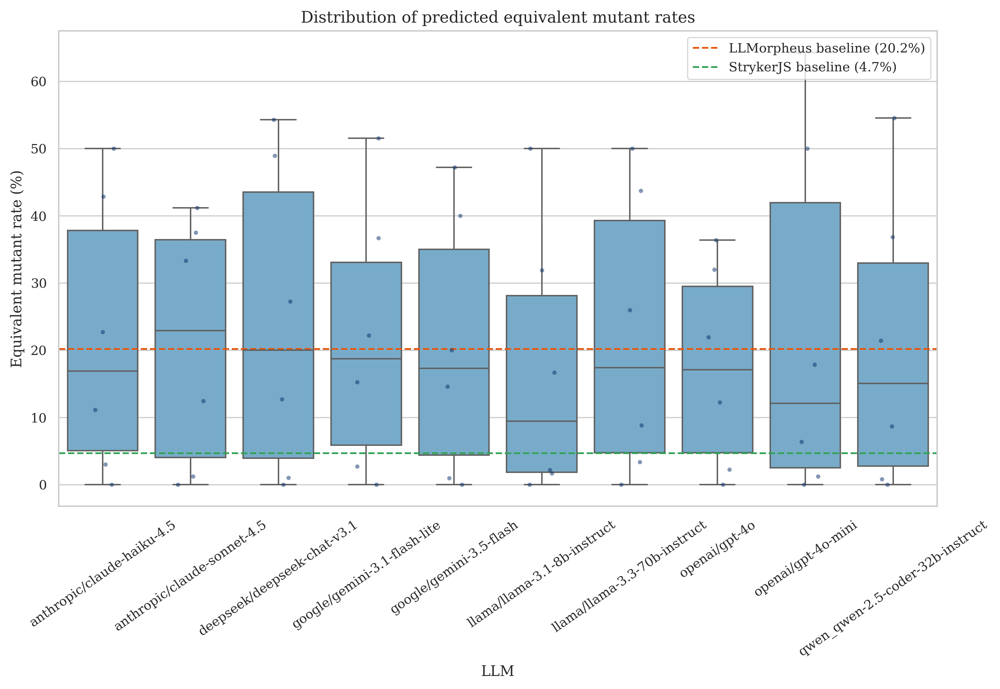
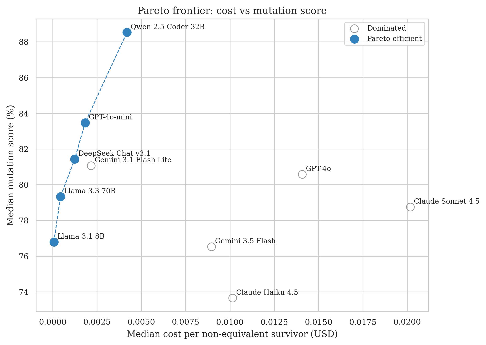
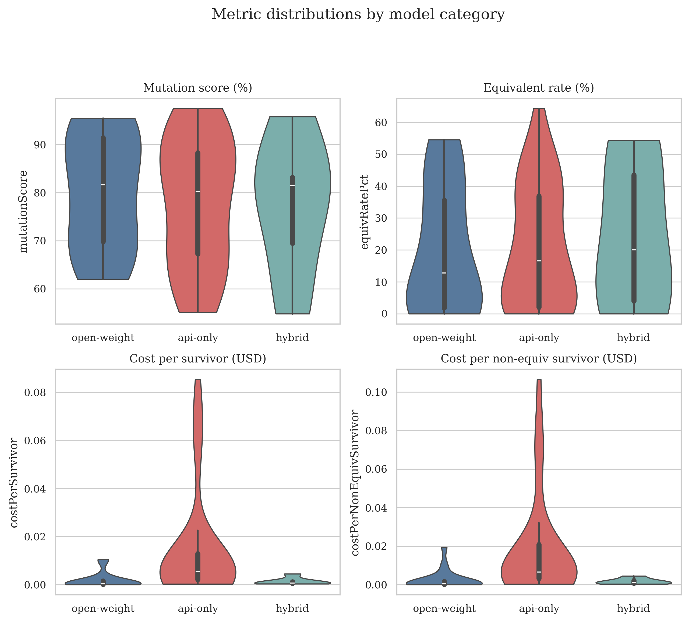

# Bachelor Thesis Exposé — Joost Windmoller

# Modern LLM Re-evaluation of LLMorpheus: Effectiveness, Stability, Equivalence, and Cost

**Document purpose:** Short description of the planned (and largely completed) bachelor thesis research project, aligned with examiners on goals, approach, and preliminary findings.

---

## Meta-Info

|                                 |               |
| ------------------------------- | ------------- |
| **Supervisor / First Examiner** | \<name here\> |
| **Second Examiner**             | \<name here\> |

---

## Introduction

Mutation testing evaluates test-suite quality by injecting small faults ("mutants") and checking whether tests detect them. Traditional tools rely on fixed mutation operators, which limits the fault patterns they can simulate. **LLMorpheus** (Tip et al., 2025) replaces hand-crafted operators with LLM-generated mutants: placeholders are inserted at code locations and an LLM proposes buggy replacements, which are filtered and executed via StrykerJS.

The original LLMorpheus study evaluated models available in 2024. Since then, the LLM landscape has changed rapidly — new model families, shifting cost profiles, and growing interest in open-weight deployment. Practitioners choosing a model for mutation testing today lack updated evidence on effectiveness, run-to-run stability, equivalent-mutant rates, and cost.

**Application domain:** JavaScript projects tested with existing unit test suites (no LLM-generated tests). **Benchmark:** six-package thesis-six subset (Complex.js, countries-and-timezones, node-jsonfile, pull-stream, spacl-core, zip-a-folder).

**Problem:** The 2024 LLMorpheus evaluation does not answer how *modern* LLMs compare under a controlled, practitioner-oriented setup.

**Research hypothesis:**

> **Modern LLMs differ meaningfully in LLMorpheus effectiveness, stability, equivalence rates, and cost; these differences are not fully explained by open-weight vs API-only deployment category.**

This thesis evaluates that hypothesis through six research questions (RQ0–RQ5) on ten contemporary models under fixed configuration (FULL prompt template, T = 0, maxTokens = 200, reasoning disabled).

---

## Approach and Preliminary Results

### Experimental approach

| Component | Detail |
|-----------|--------|
| **Models** | 10 LLMs via OpenRouter (3 open-weight, 6 API-only, 1 hybrid) |
| **Runs** | 5 repetitions for 7 affordable models (RQ2 stability); 1 run for 3 expensive models |
| **Pipeline** | GitHub Actions → LLMorpheus → Stryker → artifact extraction → `thesis` analysis scripts |
| **RQ3 classifier** | UniXCoder ensemble (θ = 0.80) on surviving mutants |
| **RQ4 pricing** | Pinned OpenRouter snapshot; cost per valid / survived / non-equivalent survivor |

RQ0 validates the pipeline internally. This thesis does **not** claim external replication of the 2024 paper.

### Preliminary results by research question

#### RQ0 — Is the experimental pipeline ready?

**Answer:** Yes. All 10 models completed successful runs (228 package-level datasets). Artifacts are non-empty and parseable; RQ1–RQ5 analysis pipelines run without missing inputs.

#### RQ1 — How many mutants do models produce and what are they?

**Answer:** Candidate volumes are similar (~301–354 per package), but validity (61–83%) and mutation scores (74–89%) differ. Qwen 2.5 Coder leads on mutation score (88.5%, 24 survivors); Claude Haiku trails (73.6%, 39 survivors). Package effects dominate; no significant model effect on score or survivors (Kruskal–Wallis, p > 0.97).

*Figure 1 — Mutation score distribution by model (RQ1).*

*Figure 2 — Candidate composition: valid, invalid, identical, duplicate (RQ1).*

#### RQ2 — How consistent are models across runs?

**Answer:** Stability varies widely at T = 0. Median Jaccard overlap ranges from 0.50 (Llama 3.3 70B) to 0.99 (Claude Haiku 4.5). Llama and DeepSeek models regenerate largely different mutant sets across five runs; Qwen and Claude Haiku are highly reproducible. Stability does not follow deployment category.

*Figure 3 — Cross-run Jaccard overlap by model (RQ2, 7 multi-run models).*

#### RQ3 — How likely are models to generate equivalent mutants?

**Answer:** Predicted equivalence rates among survivors range 17–24%, aligned with the LLMorpheus paper baseline (20.2%, manual labels) and well above StrykerJS operators (4.7%). Llama 3.1 8B is lowest (17.1%); DeepSeek highest (24.0%). Effective survivors should be preferred over raw survivor counts for comparison.

*Figure 4 — Predicted equivalence rate among survivors by model (RQ3).*

#### RQ4 — What does LLMorpheus cost per model?

**Answer:** Total cost for six packages spans $0.04 (Llama 3.1 8B) to $8.93 (Claude Sonnet 4.5). Gemini 3.1 Flash Lite costs $0.75; GPT-4o costs $5.66. Cost per non-equivalent survivor is the key decision metric: Llama 8B (~$0.00005) vs GPT-4o (~$0.014) vs Claude Sonnet (~$0.02). Cheap per-token models with high invalid rates (Claude Haiku: 32% invalid) are not cost-efficient.

*Figure 5 — Pareto frontier of total cost vs mutation score (RQ4).*

#### RQ5 — How do open-weight vs API-only models compare?

**Answer:** Category is a weak predictor. Mann–Whitney tests find no significant differences on mutation score, survivors, equivalence rate, or cost (all p > 0.38; negligible effect sizes). Open-weight models are directionally cheaper per survivor ($0.0003 vs $0.003) but overlap in effectiveness. Practitioners should choose specific models, not categories.

*Figure 6 — Mutation score, survivors, equivalence rate, and cost by category (RQ5).*

### Summary table — RQ answers at a glance

| RQ | Short answer |
|----|--------------|
| **RQ0** | Pipeline validated; 10/10 models, 228 datasets ready |
| **RQ1** | Similar volume, differing validity/score; Qwen best score, Haiku weakest |
| **RQ2** | Jaccard 0.50–0.99; Claude Haiku most stable, Llama least |
| **RQ3** | ~17–24% predicted equivalence; aligned with paper's 20.2% |
| **RQ4** | Cost spans 200×; Llama 8B most cost-efficient; GPT-4o $5.66, Gemini 3.1 Lite $0.75 |
| **RQ5** | No significant open-weight vs API-only difference |

### Open questions for the writing phase

- Final threats-to-validity section (six-package scope, classifier precision, OpenRouter-only serving).
- Tier comparisons within provider (cheap vs premium) as supplementary analysis.
- Integrate related-work positioning (Wang et al., 2025 comprehensive LLM mutation study).

---

## Preliminary Structure

The thesis will consist of the following chapters (plus abstract):

1. **Introduction** — Motivation, problem statement, research gaps, RQ0–RQ5, contributions, scope.
2. **Background and Related Work** — Mutation testing, LLM foundations, LLMorpheus technique, equivalent mutants, related LLM-mutation studies.
3. **Methodology (RQ0)** — Pipeline validation, model matrix, experimental constants, metrics, equivalence classifier, threats to validity.
4. **Results**
   - RQ1: Mutant volume, validity, mutation score, Levenshtein edit distance
   - RQ2: Cross-run stability (Jaccard, CV)
   - RQ3: Predicted equivalence rates and effective survivors
   - RQ4: Token cost, cost per useful mutant, Pareto analysis
   - RQ5: Open-weight vs API-only category comparison
5. **Discussion** — Interpretation across RQs, practitioner guidance, limitations, future work.
6. **Conclusion** — Summary of findings and contributions.

Key figures (Figures 1–6 above) anchor the Results chapter; supplementary heatmaps, forest plots, and statistical tables go to the appendix.

---

## Roadmap

| Date       | Milestone                                                        |
| ---------- | ---------------------------------------------------------------- |
| Jun 2026   | Submission of this exposé                                        |
| Jun 2026   | Complete experiment runs and analysis *(done)*                   |
| Jul 2026   | Draft Background and Methodology chapters                        |
| Jul 2026   | Draft Results (RQ1–RQ5) and Discussion                           |
| Aug 2026   | Complete thesis draft; supervisor feedback                       |
| Aug 2026   | Revise and submit final thesis                                   |

> **10-week timeline** from exposé acceptance to submission.

---

## References

Inozemtseva, L., & Holmes, R. (2014). Coverage is not strongly correlated with test suite effectiveness. In *Proceedings of the 36th International Conference on Software Engineering* (pp. 435–445). ACM. https://doi.org/10.1145/2568225.2568271

Tip, F., Bell, J., & Schäfer, M. (2025). LLMorpheus: Mutation testing using large language models. *IEEE Transactions on Software Engineering*. https://arxiv.org/abs/2404.09952

Wang, B., Chen, M., Deng, M., Lin, Y., Harman, M., Papadakis, M., & Zhang, J. M. (2025). A comprehensive study on large language models for mutation testing. *(see `thesis/references/processed/comprehensive-study-on-llms-for-mutation-test/paper.md`)*

Zhao, W. X., Zhou, K., Li, J., Tang, T., Wang, X., Hou, Y., … Wen, J.-R. (2023). A survey of large language models. *arXiv preprint arXiv:2303.18223*. https://arxiv.org/abs/2303.18223
